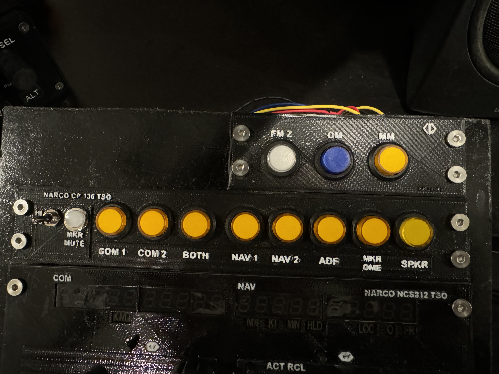
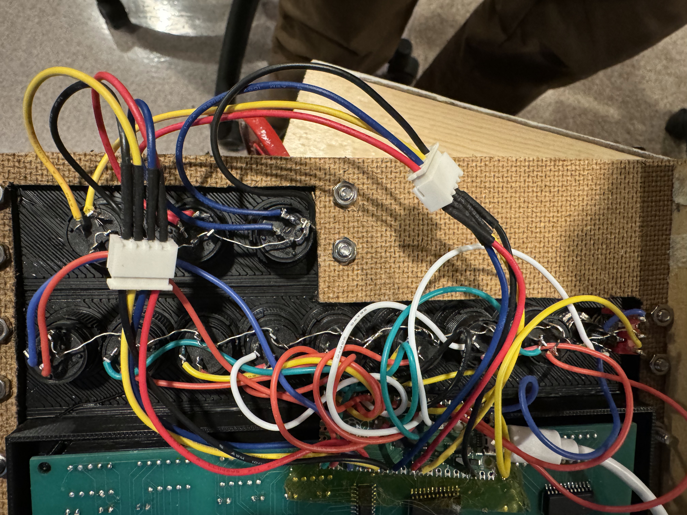

As part of the [A2A Comanche](https://a2asimulations.com/product/accu-sim-comanche-msfs/) Radio Stack, the [Narco CP 136](http://www.aeroelectric.com/Installation_Data/Narco/CP135-CP136_Installation_Manual.pdf) provides central pushbutton control for all aircraft communications and navigation audio signals. 

The Marker Beacon (Narco MBT-12) add-on is printed as a separate component here, and piggy-backs off of the CP 136 hardware.

The round buttons in the picture function as both an indicator (they are LED lit) and as a functional switch. The components are hand-wired with no custom PCB or additional circuitry besides the RP2040 Pico flashed with Mobiflight.

Hardware: 
- 12 R16-503/BD 16mm (ON)-OFF round push button switches in appropriate colors. (9 amber, 1 white, 1 blue) These momentary switches have built-in LEDs that indicate which sources are active.
- One mini-toggle switch. I used an (on)-off-on switch I had, although it should probably really be an on-off. The (on) momentary can be used as a test button or for any other purpose in the sim.
- One momentary panel-mount pushbutton. I use DS-316 OFF-(ON) Panel Mount Push Button in White.
- D4 Mounting screws and nuts.
- RP2040 Pico (Raspberry Pi 2040 Pico)
- Silcon 26 AWG stranded wire in misc colors.
- May need some wire connectors depending on your install.

Software
- Uses a basic Mobiflight setup. No custom devices or software.

Other software/tools required:
- Fusion360 to modify the case if needed.
- Mobiflight for the 
- Slicer (I use Simplify3D)
- 3D Printer (I use a FlashForge Creator Pro) and I printed in PLA.

Build steps:
- Print the two fascias. In the picture shown I've printed in black and then painted the lettering faces with white Testor's paint.
- Mount the buttons in the appropriate holes.
- Wire the ground terminals: A single wire can connect all of the LED - termnals on the buttons and one of the button terminals. I strip the insulation off of a long piece of 24 AWG solid core hook up wire then thread it through the holes on the buttons then solder. 
- Wire the individual connections to the RP 2040. I use appropriate length silicon wire and solder directly to the RP2040 terminals. Follow some sort of scheme so it's easy to configure in mobiflight later. Think about where you will mount the RP2040...I did not and now because of the wiring orientation it cannot be mounted where I intended.
- Ideally you will connect the marker beacons to PWM terminals on the RP2040. The A2A allows you to set the brightness of them. The actual unit uses a physical shutter to control the brightness. The amber buttons are fine, but the blue and white are a little bright in a darker room.
- I've included the Mobiflight files in the Software folder, but your wiring will obviously dictate the correct settings.

Notes:
- I used a connector between the 7 connections to the Marker Beacon display and the RP to help with mounting. Turned out not to be necessary.
- All of my radio panel items are sized with similar width, except the Marker beacon. They are approximately 200mm wide, but see the STEP files for exact measurements. Or do what I did and print them, then do the full panel layout on the fly.
- I should have thought of a better way to mount that RP2040. I was going to put it beside the Marker Beacon panel, but I wired it "upside down" and it won't contort to land there. Probably should have made all my hook-up wires 50mm longer.
- I strongly recommend silicon hookup wire for this. The flexibility of it made the hookup a lot easier than it would have been with solid core. I've had great results with this: https://www.amazon.com/gp/product/B07G2LRX68/
- There is not a separate Mobiflight definition file for the Marker Beacon. It's incorporated into the main CP 136 files.